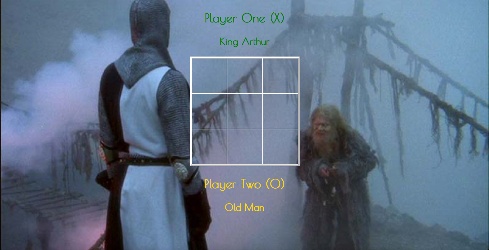
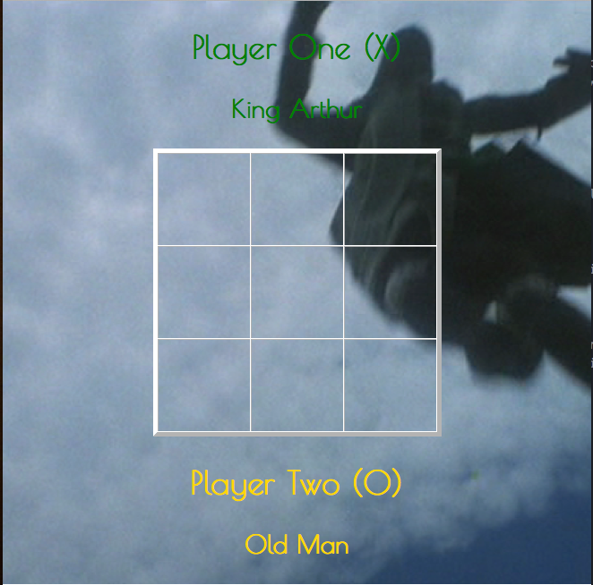

# TicTacToe

------
### UserStories

- As a user, I want to be able to play a game of TicTacToe
  - so I can play TicTacToe against another human player competitively.

- As a user, I want to be able to place a marker (X or O) on an empty board space,
  - so I can see where my move has been recorded.

- As a user, I want to be able to enter my name as player 1 or player 2,
  - so I can distinguish what turn it is or who is winning.

- As a user, I want to know when I win,
  - so I know that I am a champion of TicTacToe.

- As a user, I want to be able to know when I have lost the game,
  - so I know the has ended and I can keep track of my losses.

- As a user, I want to be able to know when a game is a draw,
  - so I can know that when the board is filled, no one has won, but the game is complete.

- As a user, I want to be able to reset my game board when the game has completed,
  - so I can play again and again and again and again...

----

-----
### Technologies

- HTML
- CSS
- Javascript/jquery
